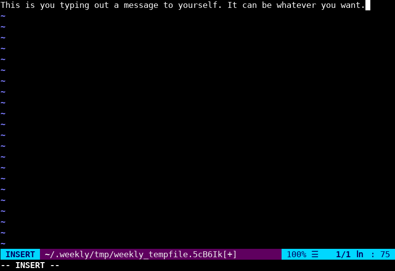

# Weekly Report Generator

# Installation

```shell
mkdir build
cd build
cmake .. -DCMAKE_INSTALL_PREFIX=/usr/local
make
```

Copy the `weekly` binary to a directory on your `PATH` or use make to finish the installation:

```shell
make install
```

# How it works

Running `weekly` without arguments opens an empty buffer in your favorite plain-text editor. Simply write your message, save, and quit. Your input will be appended to a journal corresponding to the week of the year, and the day of the week (`~/.weekly/YEAR/WEEK_NUMBER/DAY_NUMBER`). When it's time to submit a weekly report to your boss, execute `weekly -d`. If you were sick or forgot to send it, on Monday morning you can access the previous week with `weekly -d 1`. If you were on vacation for two weeks use `weekly -d 2` to read back your entries from two weeks ago, and so on.

# What kind of data does this store?

Records are stored in the format below. Each record contains the date, time, user account name, and system host name.

```
\x01\x01\x01HEADER\n
\x02\x02\x02MESSAGE\n
\x03\x03\x03\n
```

# Example

If the `EDITOR` environment variable is not defined, `vim` will be opened by default on *NIX systems, and `notepad` on Windows. To change the editor set `EDITOR` to the desired value:
```shell
export EDITOR=nano
```

## Writing (editor)

```text
[example@mycomputer ~]$ weekly
```



After saving and exiting the editor a success message will be displayed:

```text
Message written to: /home/example/.weekly/2022/3/2
```

## Writing (standard input)

```text
[example@mycomputer ~]$ echo "This is you typing out a message to yourself. It can be whatever you want." | weekly -
Message written to: /home/example/.weekly/2022/3/2
```

```text
[example@mycomputer ~]$ cat << ENDMSG | weekly -
> This is you typing out a message to yourself. It can be whatever you want.
> ENDMSG
Message written to: /home/example/.weekly/2022/3/2
```

```text
[example@mycomputer ~]$ weekly -
This is you typing out a message to yourself. It can be whatever you want.
^D
Message written to: /home/example/.weekly/2022/3/2
```

# Reading

You can dump the contents of your weekly journal in a couple different output styles. For anyone interested in managing their own data, `weekly` can also dump CSV and JSON-compatible dictionaries.

## Long style

```text
[example@mycomputer ~]$ weekly -d
## Date: 01/18/2022
## Time: 15:16:14
## User: example
## Host: mycomputer.lan
This is you typing out a message to yourself. It can be whatever you want.
```

## Short style

```text
[example@mycomputer ~]$ weekly -s short -d
01/18/2022 - 15:16:14 - example (mycomputer.lan):
This is you typing out a message to yourself. It can be whatever you want.
```

## CSV style

```text
[example@mycomputer ~]$ weekly -s csv -d
01/18/2022,15:16:14,example,mycomputer.lan,"This is you typing out a message to yourself. It can be whatever you want."
```

## Dictionary style
```text
[example@mycomputer ~]$ weekly -s dict -d
{"date": "01/18/2022",
"time": "15:16:14",
"user": "example",
"host": "mycomputer.lan",
"data": "This is you typing out a message to yourself. It can be whatever you want."}
```

# Usage

```
usage: weekly [-h] [-V] [-dDys] [-]

Weekly Report Generator v1.0.0

Options:
--help             -h        Show this usage statement
--dump-relative    -d        Dump records relative to current week
--dump-absolute    -D        Dump records by week value
--dump-year        -y        Set dump-[relative|absolute] year
--dump-style       -s        Set output style:
                               long (default)
                               short
                               csv
                               dict
--version          -V        Show version
```
